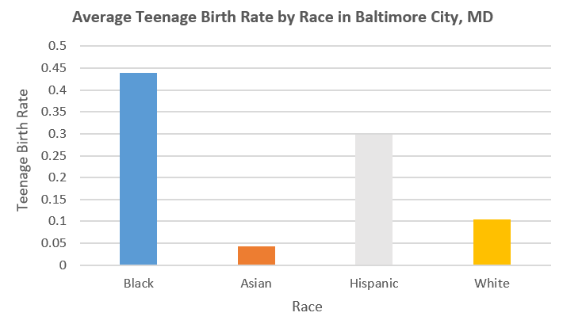
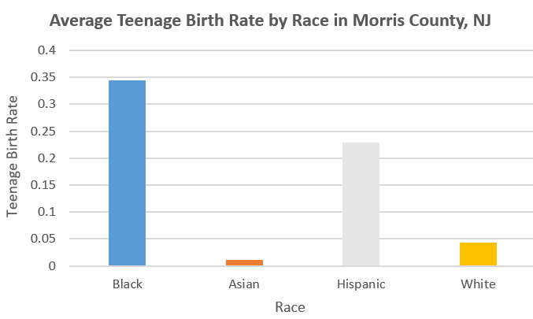

# Comparing Teenage Birth Rates between Baltimore, MD and Morris County, NJ by Race 

## Background 

Baltimore City, MD is a metropolitan area in Maryland. While some neighborhoods are primarily wealthy, others struggle economically. This affects many aspects of the city's residents' lives, including their access to education, housing and food security, and more.

In contrast, Morris County, NJ is a suburban area mostly comprised of people who have reached relatively high socioeconomic statuses. It has been named one of New Jersey's most affluent counties regularly. 

I thought it would be interesting to compare an aspect of the residents' lives between Baltimore and Morris County. Since I enjoy learning about maternal and child health, I decided to analyze teenage birth rates in these two locations. I also wanted to consider if race plays a role in the rates. 

## Business Question 

This led to the business question: How do the teenage birth rates between Baltimore City, MD and Morris County, NJ compare and how does race affect the results? 

## Data Source 

I downloaded data from [Opportunity Atlas](https://www.opportunityatlas.org/) to conduct my analysis. 

# Data Visualizations 

The dataset showed the teenage birth rates for each location per tract, but the visualizations with all of the tracts looked very cluttered. For simplication, these visualizations depict the average teenage birth rates for each race in Baltimore and Morris County. 

# Data Interpretation

Based on these charts, Baltimore City, MD shows higher teenage birth rates than Morris County, NJ. The black race displays the highest rates in both locations, followed by Hispanic, then white, then Asian. 

Based on the dataset with all of the information regarding each tract, most of the tracts in Baltimore City are congregated at a level of 0.4 to 0.6, whereas most of the tracts in Morris County are congregated between levels of 0.1 to 0.4. Broken down by race, both places have the highest rates among black people. Of the rates for black people, there are some tracts that are visibly higher than others. I wanted to see which tracts had especially high rates, and after that analysis, I found that 38.68% of the tracts in Baltimore have rates higher than the average rate for the black race, and 21.01% for Morris County. 						

# Conclusion & Recommendations 
Based on this analysis, it is reasonable to conclude that the teenage birth rates are generally higher for Baltimore City, MD than Morris County, NJ, and the black race seems to hold the highest rates for both of the locations. The analysis on which tracts have the highest tracts can be built upon by identifying the quality of the sex ed system, accessibility of convenience stores that sell birth control, and similar factors for those tracts. If the analysis shows that a lower quality sex education system and lower accessibility to contraceptives was associated with higher teenage birth rates, governments can make informed decisions on how to make policy reforms that aim for lower teenage birth rates. Planned Parenthood suggests that [better sex education does lead to better reproductive health outcomes](https://www.plannedparenthood.org/files/6813/9611/7632/Reducing_Teen_Pregnancy.pdf) such as lower teen birth; the sex education system must be comprehensive and not simply emphasizing abstinence, but rather focusing on methods of birth control that teenagers can use in order to control pregnancy. 
